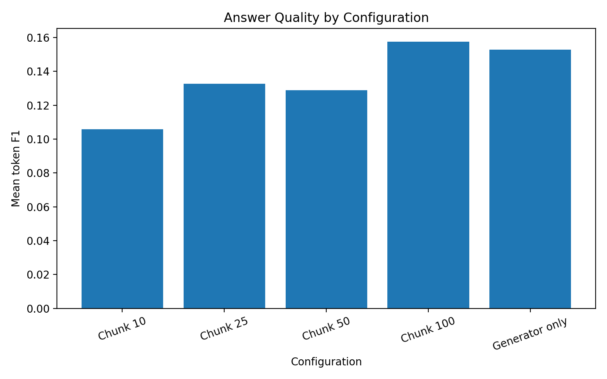
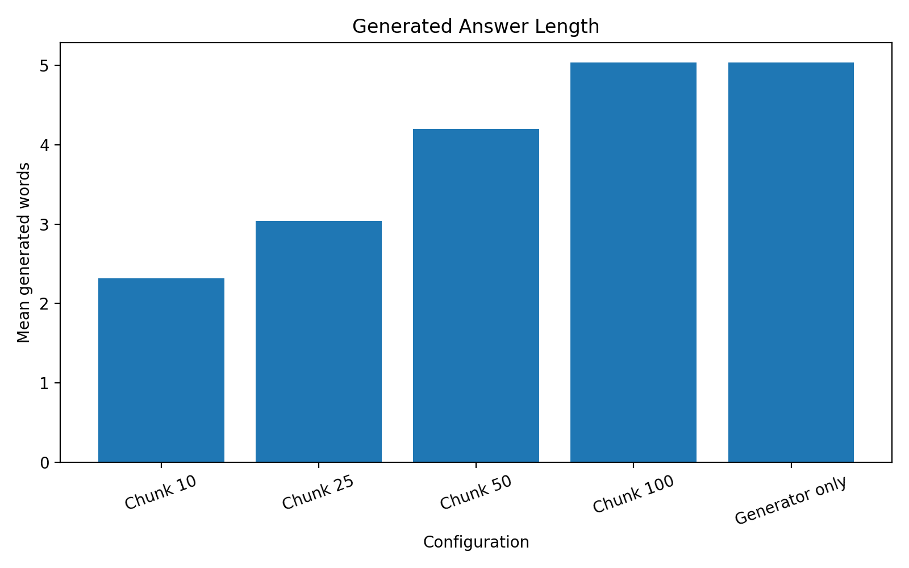
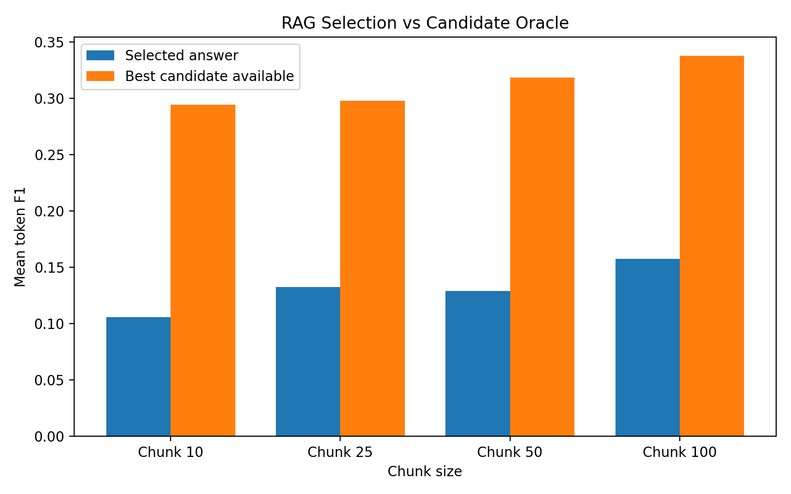
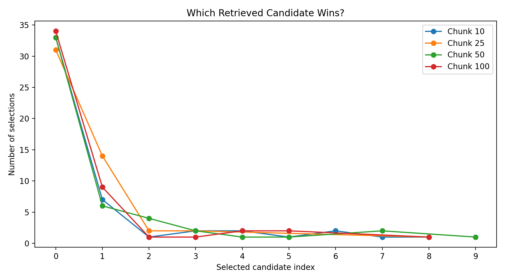

# RAG-Sequence Reproduction Report

## Overview

This project is a simplified reproduction of the core **RAG-Sequence** idea from:

> Patrick Lewis et al.  

> *Retrieval-Augmented Generation for Knowledge-Intensive NLP Tasks*  

> 2020

The goal was **not** to reproduce the paper's benchmark numbers or training setup exactly.

The goal was to build the main pieces myself, keep the implementation readable, and test how retrieval, chunk size, generation, and RAG-Sequence candidate selection behave on a small domain-specific corpus.

The corpus is built from baseball Wikipedia pages, and the evaluation set contains 50 baseball questions.

The final experiment compares four chunk sizes:

- 10 tokens

- 25 tokens

- 50 tokens

- 100 tokens

Each RAG run retrieves the top 10 chunks. A generator-only baseline is also included.

That gives:

- 50 questions × 4 RAG chunk sizes = 200 RAG outputs

- 50 generator-only outputs

- **250 total experiment outputs**

The final results are stored in:

```text

data/eval/results.json

```

---

## What This Reproduces

The main idea I wanted to reproduce is the RAG-Sequence objective:

$$
P_{\text{RAG-Seq}}(y \mid x) = \sum_z P(z \mid x) P(y \mid x,z)
$$

where:

- $x$ is the input question

- $z$ is a retrieved document or chunk

- $y$ is the complete generated answer sequence

For a generated sequence:

$$
P(y \mid x,z) = \prod_{i=1}^{N} P(y_i \mid x,z,y_{<i})
$$

In log-space, that becomes:

$$
\log P(y \mid x,z) = \sum_{i=1}^{N} \log P(y_i \mid x,z,y_{<i})
$$

The implementation therefore keeps the **sum of token log probabilities** for each complete candidate sequence rather than length-normalizing them.

For each candidate answer, the implementation computes:

$$
\log \sum_z \exp\left(\log P(z \mid x) + \log P(y \mid x,z)\right)
$$

using `torch.logsumexp`.

The candidate with the highest marginalized RAG-Sequence score becomes the final answer.

---

## What This Does Not Reproduce

This is intentionally a simplified reproduction.

The original paper trained the retriever and BART generator together for downstream knowledge-intensive QA. This project does **not** reproduce that full end-to-end training setup.

Important differences include:

- a small custom baseball corpus instead of the paper's full Wikipedia setup

- a custom 50-question baseball evaluation set

- pretrained DPR-based retrieval rather than jointly training the retriever

- FLAN-T5-large as the final standalone seq2seq generator

- one candidate generated per retrieved chunk followed by explicit RAG-Sequence-style reranking

- no attempt to reproduce the paper's published benchmark scores

Because of those differences, this repository should be read as a **small, readable RAG-Sequence reproduction and experiment skeleton**, not as an exact recreation of the original paper.

---

## Corpus and Pipeline

The high-level pipeline is:

```text

Wikipedia sources

      ↓

raw text

      ↓

chunking

      ↓

DPR context embeddings

      ↓

query embedding

      ↓

top-k dense retrieval

      ↓

retrieved chunk text

      ↓

candidate generation

      ↓

candidate likelihood under every retrieved chunk

      ↓

RAG-Sequence marginalization

      ↓

selected answer

      ↓

evaluation

```

The repository keeps these stages separated so the corpus, chunking strategy, retriever, generator, top-k value, and evaluation set can all be replaced independently.

---

## Generator Choice

The original RAG paper used a fine-tuned BART generator.

I first tested raw `facebook/bart-large`, but without the paper's downstream fine-tuning it mostly reconstructed or copied the input instead of behaving like a useful QA generator.

I then tested FLAN-T5-base. It worked as a standalone instruction-following generator, but frequently produced extremely short answers and sentence fragments.

The final experiment uses:

```text

google/flan-t5-large

```

FLAN-T5-large is not the generator from the original paper, but it behaves reliably as a standalone conditional generator and allowed the surrounding RAG-Sequence logic to be tested directly.

I also explored extracting the BART generator from the released `facebook/rag-sequence-nq` checkpoint. Used by itself inside this custom pipeline, it produced many empty strings, fragments, and copied phrases. That checkpoint was trained as part of the full RAG system rather than as an interchangeable standalone QA generator, so those exploratory results are not used as the main experiment.

---

## Experimental Setup

For each of the 50 questions:

1. Embed the query.

2. Retrieve the top 10 chunks.

3. Recover the matching chunk text.

4. Generate one candidate answer from each retrieved chunk.

5. Score every candidate against every retrieved chunk.

6. Combine generation likelihood with retrieval probability.

7. Marginalize across retrieved chunks using the RAG-Sequence objective.

8. Select the highest-scoring candidate.

This process is repeated for chunk sizes:

```text

10

25

50

100

```

The same 50 questions are also passed directly to the generator without retrieval to create the generator-only baseline.

---

# Evaluation

The evaluation harness lives in:

```text

evaluation_scripts/

```

The first version of the evaluation and plotting harness was delegated to **GPT-5.6 Sol**, then reviewed and run against the completed experiment outputs.

The evaluation intentionally reports multiple metrics rather than pretending one number completely describes answer quality.

The main metrics are:

- normalized Exact Match

- token F1

- answer containment

- generated answer length

- oracle candidate token F1

- selected-vs-oracle token F1 gap

- selected candidate index distribution

I do **not** report retrieval Recall@10 because the evaluation set does not contain ground-truth supporting passage IDs.

---

## Result Integrity

The evaluation loaded:

```text

250 experiment rows

```

and all integrity checks passed.

This verifies that:

- the expected experiment rows are present

- RAG rows contain the expected top-k fields

- candidate indices are valid

- the selected generated answer matches the recorded candidate index

- there are no duplicate experiment keys

---

## Quantitative Results

| Configuration | N | Exact Match | Token F1 | Containment | Mean answer words | Oracle candidate F1 | Oracle gap |

|---|---:|---:|---:|---:|---:|---:|---:|

| Chunk 10 | 50 | 0.000 | 0.106 | 0.420 | 2.32 | 0.294 | 0.189 |

| Chunk 25 | 50 | 0.000 | 0.133 | 0.380 | 3.04 | 0.298 | 0.165 |

| Chunk 50 | 50 | 0.000 | 0.129 | 0.320 | 4.20 | 0.319 | 0.190 |

| Chunk 100 | 50 | 0.000 | **0.158** | 0.320 | 5.04 | **0.338** | 0.180 |

| Generator only | 50 | 0.000 | 0.153 | 0.320 | 5.04 | — | — |

Exact Match is zero across all configurations because the reference answers are generally complete explanatory sentences while the generator often returns concise answers.

For example, a prediction such as:

```text

the pitcher

```

may be semantically correct for a reference such as:

```text

Traditionally, the designated hitter bats in place of the pitcher.

```

but still receives zero Exact Match.

For that reason, Exact Match should not be interpreted as the main quality metric for this experiment.

---

## Answer Quality by Configuration



The strongest selected-answer token F1 came from the **100-token chunk configuration**:

```text

Chunk 10        0.106

Chunk 25        0.133

Chunk 50        0.129

Chunk 100       0.158

Generator only  0.153

```

The 100-token RAG configuration slightly exceeded the generator-only baseline on token F1.

This does not mean the experiment proves that RAG is universally better. The difference is small, the dataset is small, and token F1 is only one lexical metric.

What it does show is that the retrieval pipeline was capable of improving the final output under the strongest chunk configuration.

---

## Chunk Size and Answer Length



Average generated answer length increased almost monotonically with chunk size:

```text

Chunk 10        2.32 words

Chunk 25        3.04 words

Chunk 50        4.20 words

Chunk 100       5.04 words

Generator only  5.04 words

```

The 10-token chunks frequently split definitions and explanations into fragments.

That left the generator with too little context to produce useful complete answers.

As chunk size increased, the generator had access to more complete ideas and answer length increased with it.

By 100 tokens, average answer length was effectively identical to the generator-only baseline.

This suggests that **very small chunks were starving the generator of usable context**.

---

## The Most Important Result: Candidate Oracle Gap



For every chunk size, the best candidate already generated by the system was substantially better than the candidate ultimately selected by the RAG-Sequence scorer.

| Chunk size | Selected F1 | Best available candidate F1 |

|---|---:|---:|

| 10 | 0.106 | 0.294 |

| 25 | 0.133 | 0.298 |

| 50 | 0.129 | 0.319 |

| 100 | 0.158 | 0.338 |

At chunk size 100, the average selected answer reached only:

```text

0.158 token F1

```

while the best candidate already present among the ten generated candidates reached:

```text

0.338 token F1

```

This is the clearest finding from the experiment.

The pipeline often generated a significantly better answer, but the final candidate-selection stage failed to choose it.

That means at least part of the performance loss happens **after candidate generation**.

This does not prove that the original RAG-Sequence objective is flawed.

The original paper used a jointly trained retriever-generator system and a more integrated decoding setup. My simplified implementation generates one candidate from each retrieved chunk and then reranks those candidates afterward.

The oracle gap therefore exposes a limitation of **this simplified candidate proposal + selection setup**, not a general failure of RAG-Sequence.

---

## Candidate Selection Is Strongly Concentrated Near the Top Retrieval Ranks



Across the 200 RAG runs:

- candidate 0 was selected **131 / 200 times**

- candidate 0 or candidate 1 was selected **167 / 200 times**

That means:

```text

Candidate 0 selection rate:       65.5%

Candidate 0 or 1 selection rate:  83.5%

```

Candidate 0 corresponds to the candidate generated from the highest-ranked retrieved chunk.

This shows that the final selection is heavily concentrated around candidates generated from the first one or two retrieved documents.

There are multiple possible reasons for this:

1. the top retrieved document often really is the best context

2. its candidate is naturally highly probable under the same document that generated it

3. the retrieval prior gives that document more weight

4. the candidate proposal process and final RAG score are therefore partially coupled

This makes retrieval ranking extremely influential in the simplified implementation.

Again, this should not be interpreted as evidence that the RAG-Sequence equation itself is wrong.

It is an observed behavior of this reproduction.

---

# Failure Analysis

The pipeline can fail in at least three different places.

## 1. Retrieval Failure

The relevant evidence is not present in the retrieved top-k chunks.

If the answer is not available to the generator, downstream generation cannot recover it reliably.

## 2. Generation Failure

Useful evidence is retrieved, but none of the generated candidates properly answers the question.

In this case, reranking cannot select a good answer because one was never generated.

## 3. Selection Failure

Useful evidence is retrieved and at least one strong candidate is generated, but the RAG-Sequence selection stage chooses a worse candidate.

The oracle-candidate analysis suggests that this third category is especially important in this experiment.

The script:

```text

evaluation_scripts/build_review_sheet.py

```

creates:

```text

data/eval/failure_review.csv

```

and sorts cases by oracle gap so the most interesting selection failures can be manually reviewed first.

The final failure labels should still be assigned manually rather than pretending token overlap can perfectly determine whether a failure came from retrieval, generation, or selection.

---

# Main Findings

The experiment produced four main findings.

### 1. Chunk size matters

Ten-token chunks were generally too fragmented.

Larger chunks gave the generator more complete context and produced longer, higher-quality answers.

### 2. The 100-token configuration performed best

Chunk 100 achieved the strongest selected-answer token F1:

```text

0.158

```

which slightly exceeded the generator-only baseline:

```text

0.153

```

### 3. Candidate generation was better than final selection

The 100-token configuration had an oracle candidate F1 of:

```text

0.338

```

compared with only:

```text

0.158

```

for the selected candidate.

A significant amount of answer quality was therefore lost during candidate selection.

### 4. Selection was heavily concentrated at the top of retrieval

Candidate 0 won 65.5% of all RAG trials.

Candidates 0 and 1 together won 83.5%.

That suggests retrieval rank has a very strong influence on the final output in this simplified system.

---

# Limitations

This experiment has several important limitations.

## Small Evaluation Set

The evaluation contains only 50 custom baseball questions.

The results are useful for understanding this implementation, but they should not be treated as broad statistical evidence about RAG systems in general.

## Custom Reference Answers

The reference answers are usually complete sentences, while generated answers can be very short.

This causes Exact Match to be nearly useless and also causes token F1 to under-credit some semantically correct short answers.

## Lexical Metrics

Token F1 and containment measure lexical overlap.

They do not perfectly capture semantic correctness.

The oracle analysis is therefore best used as a diagnostic rather than as an absolute measurement of answer quality.

## No Gold Supporting Passage Labels

There are no ground-truth passage IDs for each question.

Because of that, this report does not claim retrieval Recall@K.

## No End-to-End Fine-Tuning

The original paper jointly trained the retrieval and generation components.

This implementation uses pretrained retrieval and a standalone generator.

That difference is likely important, especially for candidate scoring and final answer selection.

## Simplified Candidate Generation

One candidate is generated independently from each retrieved chunk and those candidates are reranked afterward.

That is easier to understand and implement, but it is not identical to the paper's full decoding setup.

---

# Why the Repository Is Still Useful

The point of this repository is not to provide a production RAG framework.

It is meant to be a readable skeleton that makes the architecture visible.

Someone can replace:

```text

baseball corpus

DPR retriever

FLAN-T5 generator

chunk sizes

top-k

evaluation questions

```

without replacing the whole project.

The main stages stay visible:

```text

chunk

embed

retrieve

generate

score

marginalize

evaluate

```

That makes it useful for learning what RAG is actually doing instead of hiding everything behind a framework call.

The failures are part of that value.

This project exposed several behaviors that would have been much harder to notice from a high-level RAG library:

- tiny chunks destroying useful context

- retrieval rank dominating candidate selection

- good candidates being generated but rejected

- generator choice strongly affecting the entire pipeline

- the difference between retrieval failure, generation failure, and selection failure

---

# Reproducing the Evaluation

From the `001_rag` directory:

```bash

python evaluation_scripts/evaluate_results.py

python evaluation_scripts/plot_results.py

python evaluation_scripts/build_review_sheet.py

```

The evaluation writes:

```text

data/eval/metrics/

├── metrics_summary.json

└── per_question_metrics.json

```

The plotting script writes:

```text

data/eval/plots/

├── answer_length_by_configuration.png

├── candidate_index_histogram.png

├── selected_vs_oracle_f1.png

└── token_f1_by_configuration.png

```

The review script writes:

```text

data/eval/failure_review.csv

```

---

# Conclusion

This reproduction did not recreate the original RAG paper's full training pipeline, and it was never intended to.

What it did accomplish was building the core retrieval → generation → RAG-Sequence scoring flow in a small enough system that each piece could be inspected directly.

The strongest configuration used 100-token chunks and slightly exceeded the generator-only baseline on token F1.

More importantly, the experiment showed that the system frequently generated better answers than it ultimately selected.

That makes the most interesting result of this project less about a single final accuracy number and more about **where information is lost inside the pipeline**.

For me, that was the point of reproducing the paper in the first place.